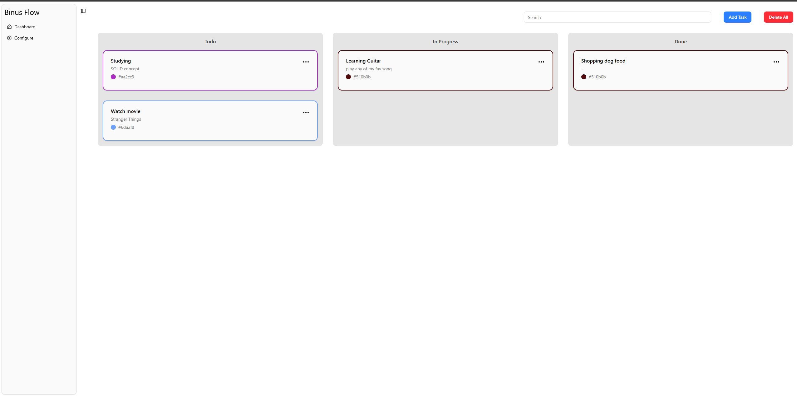
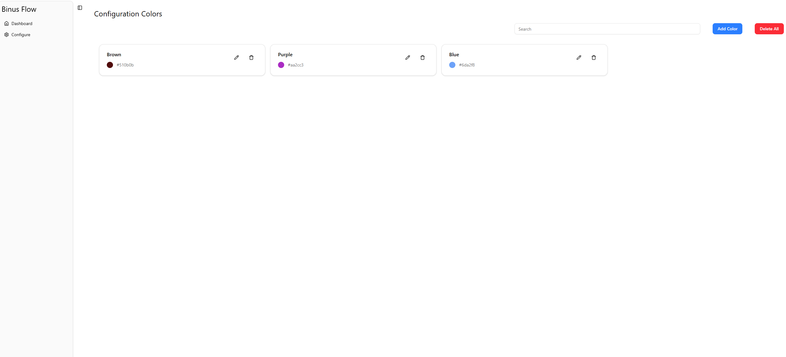

# BinusFlow - React Task & Color Management System
> **Tugas Advance Project - IT DIVISION**

**BinusFlow** adalah aplikasi Kanban Board interaktif berbasis **React (Next.js)** yang dilengkapi dengan sistem konfigurasi warna kustom untuk membedakan kategori tugas secara visual. Proyek ini dibangun menggunakan arsitektur modern Next.js App Router, TailwindCSS v4, state management Zustand (dengan persistensi lokal), drag-and-drop `@dnd-kit/core`, serta form validation menggunakan Zod dan React Hook Form.

---

## 📸 Tampilan UI (Screenshots)

### 1. Dashboard / Kanban Board
Halaman utama yang menampilkan papan Kanban dengan tiga kolom (`Todo`, `In Progress`, `Done`). Kartu tugas dapat digeser (drag & drop) antar kolom, dicari secara real-time, ditambahkan, diperbarui, atau dihapus. Kartu tugas memiliki garis tepi (border) berwarna dinamis sesuai kategori warna yang dipilih.



### 2. Configuration Colors Page
Halaman konfigurasi warna untuk membuat label warna baru, memperbarui label/hex warna yang sudah ada, atau menghapusnya. Perubahan warna di sini akan secara otomatis memperbarui warna kartu tugas yang bersangkutan (Cascading Update).



---

## 🌟 Fitur Utama (Core Features)

1. **Interaktif Kanban Board (Drag & Drop)**
   - Menggunakan library `@dnd-kit/core` untuk interaksi seret-dan-lepas kartu tugas antar kolom (`TODO`, `IN_PROGRESS`, `DONE`) secara mulus.
2. **Cascading State Update (Sinkronisasi Otomatis)**
   - **Update Warna**: Ketika Anda mengubah kode warna HEX di halaman *Configure*, semua kartu tugas yang menggunakan warna tersebut akan langsung berubah warna secara otomatis di *Dashboard*.
   - **Hapus Warna**: Ketika suatu warna dihapus dari konfigurasi, kartu tugas yang menggunakan warna tersebut akan otomatis dialihkan ke warna default (`#000000`).
3. **Pencarian Cepat dengan Debounce**
   - Fitur pencarian tugas berdasarkan judul maupun deskripsi menggunakan delay debounce sebesar 300ms untuk menghemat performa rendering (re-render) saat mengetik.
4. **Persistensi Data Lokal (Local Storage)**
   - Menyimpan seluruh data tugas (`task-storage`) dan daftar warna (`colors-storage`) ke dalam `localStorage` browser menggunakan middleware `persist` dari **Zustand**. Data tetap aman dan tidak hilang meskipun halaman di-refresh.
5. **Validasi Form yang Aman**
   - Penambahan dan pembaruan data divalidasi di sisi klien menggunakan schema **Zod** dan **React Hook Form** untuk mencegah kesalahan pengisian data (seperti input kosong atau teks terlalu panjang).

---

## 🛠️ Tech Stack & Library

* **Framework Utama**: Next.js 16.0.7 (App Router dengan Turbopack)
* **Library UI & Styling**:
  * **TailwindCSS v4**: Utilitas CSS modern dan berkinerja tinggi.
  * **Shadcn UI & Radix UI**: Komponen UI aksesibel seperti Dialog, Dropdown Menu, Sidebar, Tooltip, dan Card.
  * **Lucide React**: Library ikon vektor yang modern dan konsisten.
* **State Management**:
  * **Zustand**: Pengelola state global yang ringan dan cepat, dipadukan dengan middleware `persist` untuk penyimpanan otomatis ke `localStorage`.
* **Drag-and-Drop**:
  * **@dnd-kit/core**: Utilitas drag-and-drop berkinerja tinggi untuk ekosistem React.
* **Form & Validation**:
  * **React Hook Form & Zod**: Validasi skema input yang deklaratif dan aman secara tipe (type-safe).

---

## 📁 Struktur Folder & Arsitektur

Berikut adalah struktur folder utama dari proyek **BinusFlow**:

```bash
src/
├── app/
│   ├── color/
│   │   └── page.tsx        # Halaman Konfigurasi Warna (/color)
│   ├── globals.css         # Styling global TailwindCSS
│   ├── layout.tsx          # Layout utama (Sidebar, Main Content wrapper)
│   └── page.tsx            # Halaman utama Kanban Board (/)
├── components/
│   ├── color/              # Komponen khusus manajemen warna (Form, Card, Modal, dll)
│   ├── ui/                 # Komponen dasar Shadcn UI (Button, Dialog, Input, dll)
│   ├── Column.tsx          # Komponen Kolom Kanban (Drop Zone)
│   ├── TaskCard.tsx        # Komponen Kartu Tugas (Draggable Item)
│   ├── TaskDialog.tsx      # Modal untuk Tambah/Ubah/Hapus Tugas
│   └── app-sidebar.tsx     # Komponen navigasi Sidebar (Dashboard & Configure)
├── constants/
│   └── Task.constants.ts   # Konstanta awal kolom dan data tugas dummy
├── lib/
│   └── utils.ts            # Helper utilitas classnames (cn)
├── schemas/
│   ├── ColorSchema.ts      # Skema validasi Zod untuk warna
│   └── TaskSchema.ts       # Skema validasi Zod untuk tugas
├── store/
│   ├── ColorStore.ts       # Zustand store untuk konfigurasi warna (colors-storage)
│   └── TaskStore.ts        # Zustand store untuk manajemen tugas (task-storage)
└── types/
    ├── Color.d.ts          # Type definition untuk tipe data Warna
    └── Task.d.ts           # Type definition untuk tipe data Tugas & Kolom
```

---

## 🚀 Cara Menjalankan Proyek Secara Lokal

Ikuti langkah-langkah berikut untuk menjalankan proyek di perangkat Anda:

### 1. Prasyarat
Pastikan Anda sudah menginstal **Node.js** (versi 18 ke atas disarankan) dan **npm** di komputer Anda.

### 2. Instalasi Dependensi
Jalankan perintah berikut di terminal pada direktori proyek untuk menginstal semua package yang diperlukan:
```bash
npm install
```

### 3. Menjalankan Server Development
Jalankan server lokal dengan menggunakan perintah:
```bash
npm run dev
```
Setelah server berjalan, buka browser dan akses alamat:
* **Lokal**: [http://localhost:3000](http://localhost:3000)

### 4. Build untuk Produksi
Jika ingin melakukan build proyek untuk produksi:
```bash
npm run build
```
Dan jalankan dengan:
```bash
npm run start
```
